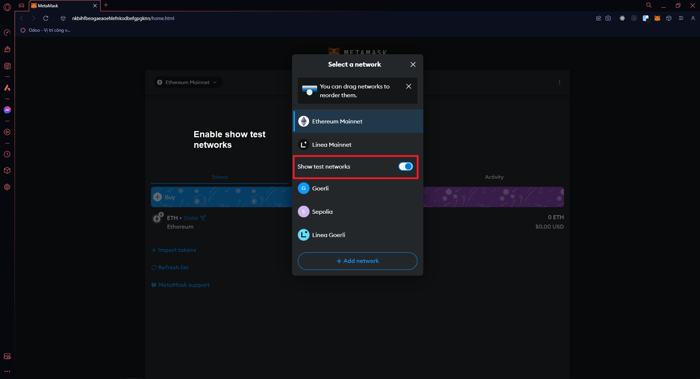
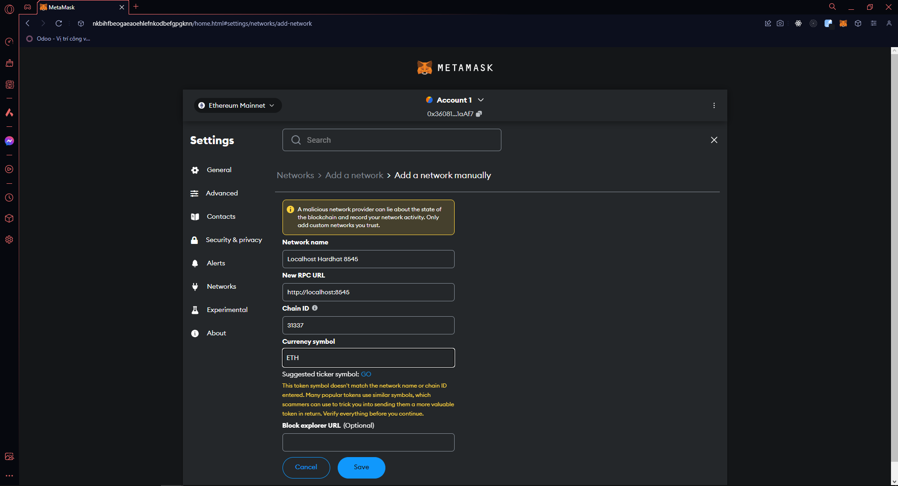
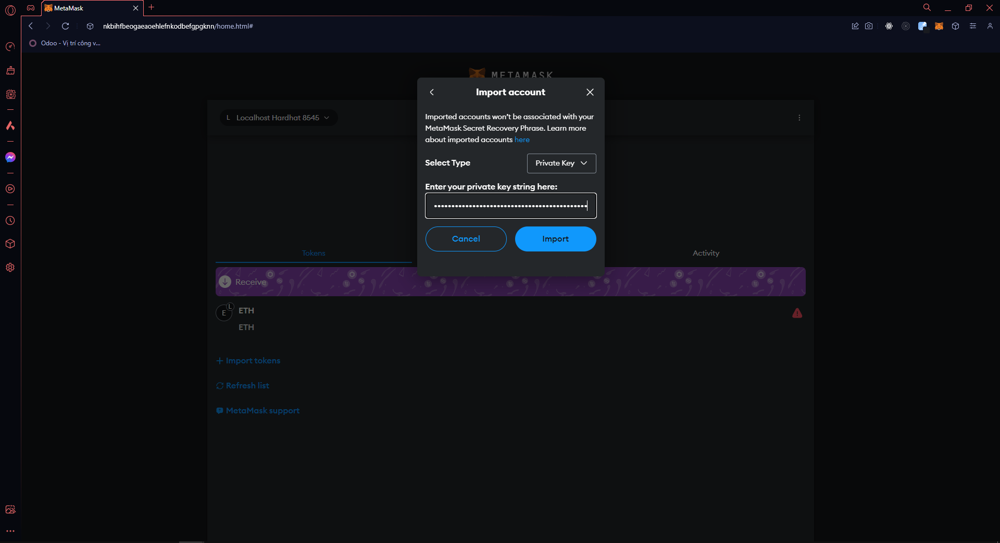

# BLOCKCHAIN GETTING STARTED APP DOCUMENTATION

 

## 💻 Technical Stack

- [React.js](https://react.dev) - The library for web and native user interfaces
- [Hardhat](https://hardhat.org) - Ethereum development environment for professionals
- [Web3](https://web3js.readthedocs.io/en/v1.10.0/) - web3.js is a collection of libraries that allow you to interact with a local or remote ethereum node using HTTP, IPC or WebSocket.

## 💽 Compile Hardhat app command

```console
    /server/contract/npx hardhat compile
```

## 💎 Deploy Hardhat app command

* First, run command below

```console
    /server/contract/npx hardhat node
```

* After that, your app will generate some account with **#number tag** and **private key**
* Now, Choose one & save private key for example: **0xac0974bec39a17e36ba4a6b4d238ff944bacb478cbed5efcae784d7bf4f2ff80**

### Enable show test networks

**NOTE: Make sure you have run command `npx hardhat node`**



### Add hardhat networks


### Import new account with private key



## 💡 Connecting a wallet or Dapp to Hardhat Network

* Run command below

```console
    /server/contract/npx hardhat run scripts/deploy.js --network localhost
```

* After that, your app will deploy with address for example: **0x5FbDB2315678afecb367f032d93F642f64180aa3**
* Remember to **save** address key

## ⚙️ Config .env file

Config [.env]() file in root dir with path `./client/.env`

```bash
VITE_ACCOUNT_ADDRESS=0x5FbDB2315678afecb367f032d93F642f64180aa3
VITE_NETWORK_URL=ws:///127.0.0.1:8545
```

## 📦 Run React app client

```console
    /client/npm run dev
```